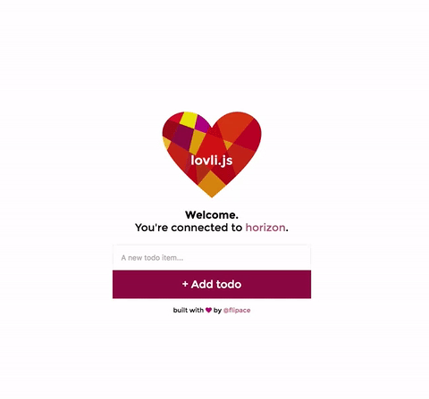

[](https://www.bithound.io/github/flipace/lovli.js)
[](https://www.bithound.io/github/flipace/lovli.js/master/dependencies/npm)
[](https://www.bithound.io/github/flipace/lovli.js)


# lovli.js
A starter kit which allows you to develop realtime applications in minutes.



**Demo:** [lovli.neschkudla.at](http://lovli.neschkudla.at/)

### Stack

- [facebook/react](https://github.com/facebook/react) - View
- [rethinkdb/horizon](https://github.com/rethinkdb/horizon) - Realtime Database Sync
- [flipace/horizon-react](https://github.com/flipace/horizon-react) - Connect View + Data
- [gaearon/react-hot-loader](https://github.com/gaearon/react-hot-loader) - Hot Reloading of React Components
- [webpack/webpack](https://github.com/webpack/webpack) - Builds & Dev-Server

### Installation
``` bash
$ git clone --depth=1 https://github.com/flipace/lovli.js
$ cd lovli.js
$ npm i
```

You'll need to have RethinkDB running.

### Run
``` bash
$ npm start # starts app in dev mode
$ npm run prod # starts server in production mode
$ npm run build # builds source files in .build/
$ node .build/server.bundle.js # starts server (after you built with npm run build)
```

This will start a server listening on port ```3000```.
*You can change the port in* ```config/page.js``` *or by setting the ```PORT``` environment variable*.

### Configure horizon
If you want to configure the props for the horizon client, you can do that
by passing a configuration object as the first parameter to ```HorizonConnector()``` in ```source/client/containers/Root.js``` and the target element as the second parameter.

The props you provide there will be passed to ```horizon()```.

### FAQ

#### How to add vendor scripts and css?
If you want to add any vendor javascript or css, you'll likely not want it to be processed by
babel or localized by css loader.

Add these scripts to the static/vendor folder and they will use a different loader configuration.

#### How to configure data subscriptions?
Check out [flipace/horizon-react](https://github.com/flipace/horizon-react) for documentation of the
horizon-react ```subscribe``` function.

#### Why won't the server reload?
The server won't hot reload. It would be possible to implement a restart on file change though.

### Contributing
Pull Requests are very welcome!

If you find any issues, please report them via [Github Issues](https://github.com/flipace/lovli.js/issues)!

### License
(MIT)
